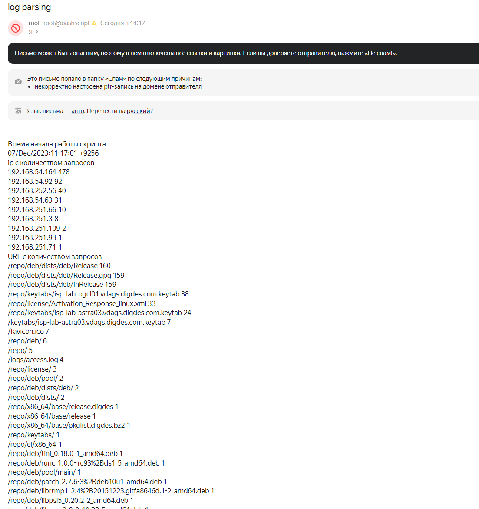
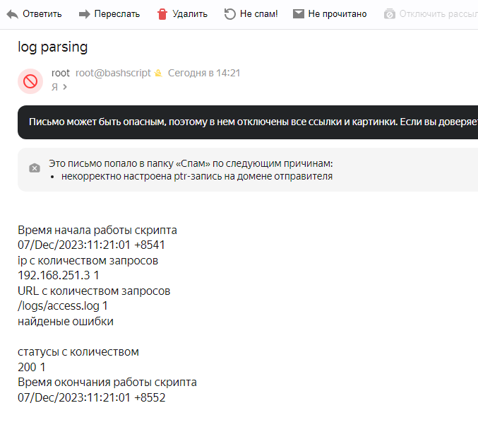
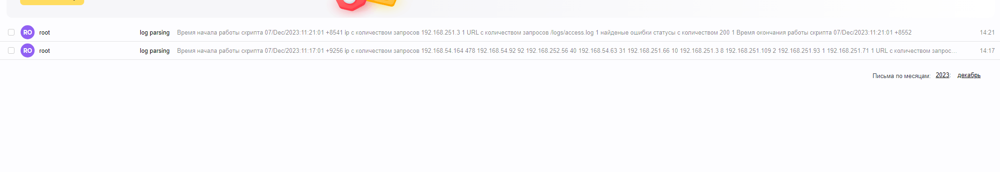

# Home 09 Bash

<details>
  <summary>Задание</summary>

```
Написать скрипт для CRON, который раз в час будет формировать письмо и отправлять на заданную почту.

Необходимая информация в письме:

Список IP адресов (с наибольшим кол-вом запросов) с указанием кол-ва запросов c момента последнего запуска скрипта;
Список запрашиваемых URL (с наибольшим кол-вом запросов) с указанием кол-ва запросов c момента последнего запуска скрипта;
Ошибки веб-сервера/приложения c момента последнего запуска;
Список всех кодов HTTP ответа с указанием их кол-ва с момента последнего запуска скрипта.
Скрипт должен предотвращать одновременный запуск нескольких копий, до его завершения.

В письме должен быть прописан обрабатываемый временной диапазон.
```


<details>
  <summary>объяснение скрипта</summary>

для использоввания скрипта в проме следует заменить переменные с указаниями путей логов  т.п. на параметры типа $1 и т.п.    
Данный скрипт является демонстрацией    

задаем путь запуска скрипта  

```path_scr=$(dirname "$0")```    

проверяем установлени ли flock, если нет - ставим

```
if ! command -v flock
then
    apt-get install -y util-linux
fi
```

конструкция для ограничения копий запущенных скриптов  
с помощью flock создаем файл блокировки, если он существует, скрипт не запустится  
в случае выхода или остановки скрипта вешает трап, чтобы файл блокировки удалился   

```
trap "rm -rf $path_scr/.myscript.exclusivelock" QUIT INT TERM EXIT
(
  flock -x -w 10 200
  if [ "$?" != "0" ]; then echo Cannot lock!; exit 1; fi
  echo $$>>$path_scr/.myscript.exclusivelock 

  ...
) 200>$path_scr/.myscript.exclusivelock  

```

читаем access.log и загоняем его в переменную   

```
log_file="$path_scr/access1.log"
    file=$(<$log_file)
```

проверяем, существует ли файл с указанием на последнюю прочитанную строку (берем дату из строки) при предыдущем запуске - требуется для того, чтобы отсечь ранее обработанные данные.  
Если файл существует, загоняем в переменную дату из него и отсекаем в переменной с логом все, что выше строки с полученной датой

```
    if [ -f "$path_scr/last_str" ]
    then
        last_time=$(<$path_scr/last_str)
        file=$(echo "$file" | grep -A $(echo "$file" | wc -l) "$last_time" | sed 1d)
    fi

```

count_ips - Список IP адресов (с наибольшим кол-вом запросов) с указанием кол-ва запросов c момента последнего запуска скрипта;  
count_requests - Список запрашиваемых URL (с наибольшим кол-вом запросов) с указанием кол-ва запросов c момента последнего запуска скрипта;  
count_status - Список всех кодов HTTP ответа с указанием их кол-ва с момента последнего запуска скрипта.  
errors - Ошибки веб-сервера/приложения c момента последнего запуска;  

first_str - время в первой строке скрипта  
pre_last_str - предварительное время в последней строке скрипта (может быть пустым, в случае, когда изменений с последнего прогона не было)  

if [[ -z $pre_last_str ]] - проверяем, пустая ли строка, если так, то в переменную загоняем last_time из файла, чтобы при следующем прогоне начать с требуемой строки, иначе, указываем pre_last_str  

```

        count_ips=$(echo "$file" | awk '{print $1}' | sort | uniq -c | awk '{print $2 " " $1}' | sort -rn -k 2 ) 
        count_requests=$(echo "$file" | awk -F'"' '{print $2}' | grep -v '^\\x' | awk '{print $2}'| sort | uniq -c | awk '{print $2 " " $1}' | sort -rn -k 2 )
        count_status=$(echo "$file" | awk -F'"' '{print $3}' | grep -v '^\\x' | awk '{print $1}'| sort | uniq -c | awk '{print $2 " " $1}' | sort -rn -k 2 )
        errors=$(echo "$file" | awk -F'"' '{print $3}' | grep -v '^\\x' | awk '{print $1}'| sort | uniq | awk '{ if ($1>299) print $1}')
        #last_time_str=$(echo "$file" | sed -e 's/.*\[//' -e 's/].*//' | tail -n 1 | read d; date -d "$d" +'%s')
        first_str=$(echo "$file" | sed -e 's/.*\[//' -e 's/].*//' | head -n 1 )
        pre_last_str=$(echo "$file" | sed -e 's/.*\[//' -e 's/].*//' | tail -n 1 )
        if [[ -z $pre_last_str ]]
        then
            last_time_str=$last_time
        else
            last_time_str=$pre_last_str
        fi
```

создаем сообщение для отправки с датами начала и конца работы скрипта, записываем в файл  

```
        echo "Время начала работы скрипта" > $path_scr/message
        echo "$(date '+%d/%b/%Y:%H:%M:%S +%4N')">>$path_scr/message

        echo "ip с количеством запросов" >> $path_scr/message
        echo "$count_ips">>$path_scr/message
        echo "URL с количеством запросов">>$path_scr/message
        echo "$count_requests">>$path_scr/message
        echo "найденые ошибки">>$path_scr/message
        echo "$errors">>$path_scr/message
        echo "статусы с количеством">> $path_scr/message
        echo "$count_status">>$path_scr/message

        echo "Время окончания работы скрипта" >> $path_scr/message
        echo "$(date '+%d/%b/%Y:%H:%M:%S +%4N')">>$path_scr/message
```

проверяем pre_last_str, если длина не 0, то отправляем письмо. Если была ошибка при отправке,  в last_time_str пишем first_str, для повторной попытки отправить  
и записываем в файл время последней строки лога.

```
if [[ ! -z $pre_last_str ]]
    then
        ms=$(cat $path_scr/message)
        echo "$ms" | mail -s 'log parsing' a@altemans.ru
        if [ $? -eq 0]
        then
            last_time_str=$first_str
        fi
    fi
    echo $last_time_str > $path_scr/last_str
```

выводим результат работы скрипты в конце для возможности дальнейшей обработки

```
FLOCKEXIT=$? 

exit $FLOCKEXIT  
```

  

</details>


<details>
  <summary>подготовка виртуалки</summary>

для работы добавим установку тихую postfix и mailutils
отключим у postfix использование ipv6, т.к. с яндексом их отбрасывает
и создадим задание в кроне на каждую минуту

```
bashscript.vm.provision "shell", inline: <<-SHELL
	    chmod +x /tmp/script.sh
        apt-get update
        echo "postfix postfix/mailname string test@altemans.ru" | debconf-set-selections
        echo "postfix postfix/main_mailer_type string 'Internet Site'" | debconf-set-selections
        DEBIAN_FRONTEND=noninteractive apt-get install -y postfix
        apt-get install mailutils -y
        echo "* * * * * root /tmp/script.sh" | tee -a /etc/crontab
        sed -i 's/inet_protocols = all/inet_protocols = ipv4/' /etc/postfix/main.cf
        systemctl restart postfix
        SHELL
```

</details>

результат 
  

первое письмо  
добавляем в лог доп строку с изменением времени  
  


всего пришло 2 письма, без постоянной долбежки в почту  



</details>